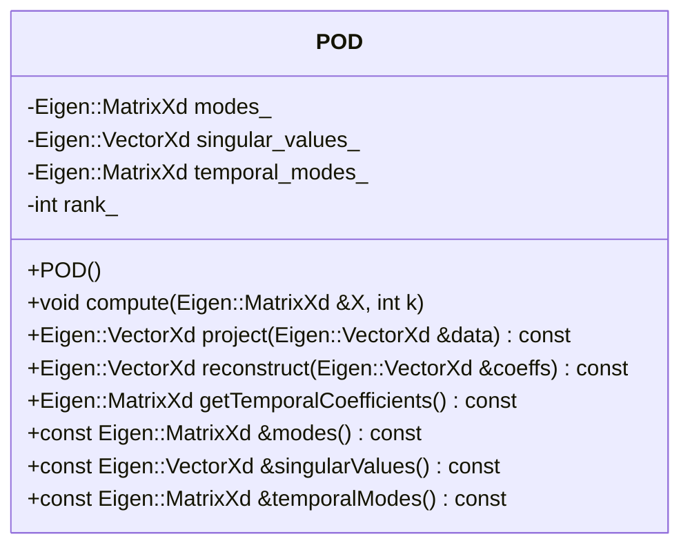

# Proper Orthogonal Decomposition

## 基本原理
POD（Proper Orthogonal Decomposition）是一种数据矩阵分解方法，
这种分解方式也称为奇异值分解（Singular Value Decomposition，SVD）。

数据矩阵$D$的POD分解可以表示为：

$$
D = U \Sigma V^T
$$

SVD分解的特性是，两个矩阵$U$和$V$是即是正交矩阵，也是归一化的矩阵。
因此有：

$$
U^T U = I, \quad U U^T = I
$$

$$
V^T V = I, \quad V V^T = I
$$

SVD分解中的$\Sigma$是一个对角矩阵，对角线上的元素为$\sigma_i$。

一旦完成矩阵的SVD分解，就可以得到矩阵$D$的拟合矩阵：

$$
D \approx \widetilde {D}_\tau = A_1 \sigma_1 + A_2 \sigma_2 + \cdots + A_\tau \sigma_\tau
$$

通过将分解模态带入拟合矩阵，可以得到拟合矩阵的模态：

$$
A_i = U(:, i) \cdot V(:, i)^T
$$

从这里我们可以看出，$A_i$是一个秩为1的矩阵，因此$A_i$的物理含义是，
矩阵$D$的第$i$个模态。

而且，数据矩阵的拟合矩阵还可以写为矩阵运算的形式：

$$
\widetilde{D}_\tau = U(:, 1:\tau) \Sigma(1:\tau, 1:\tau) V(:, 1:\tau)^T
$$

## Eckart-Young 定理

Eckart-Young 定理指出，矩阵 \(D\) 在 Frobenius 范数或谱范数意义下的最佳秩-\(k\) 近似由 \(D\) 的截断奇异值分解（SVD）给出。

### 证明概述

给定一个矩阵 \(D\) 及其 SVD：

\[
D = U \Sigma V^T
\]

其中 \(U\) 和 \(V\) 是正交矩阵，\(\Sigma\) 是一个对角矩阵，其奇异值满足 \(\sigma_1 \geq \sigma_2 \geq \cdots \geq \sigma_n \geq 0\)。

秩为 \(k\) 的截断 SVD 为：

\[
D_k = U_k \Sigma_k V_k^T
\]

其中 \(U_k\) 和 \(V_k\) 分别由 \(U\) 和 \(V\) 的前 \(k\) 列组成，\(\Sigma_k\) 是包含前 \(k\) 个奇异值的 \(k \times k\) 对角矩阵。

### 截断误差

用 \(D_k\) 近似 \(D\) 的误差为：

\[
\|D - D_k\|_F^2 = \sum_{i=k+1}^{n} \sigma_i^2
\]

其中 \(\|\cdot\|_F\) 表示 Frobenius 范数。这是因为矩阵的 Frobenius 范数是其奇异值平方和的平方根。

### 最优性

Eckart-Young 定理断言 \(D_k\) 是 \(D\) 的最佳秩-\(k\) 近似，意味着对于任何秩为 \(k\) 的矩阵 \(B\)：

\[
\|D - B\|_F \geq \|D - D_k\|_F
\]

这是因为任何其他秩-\(k\) 近似 \(B\) 可以表示为：

\[
B = U_k \Sigma_k V_k^T + E
\]

其中 \(E\) 是一个与 \(U_k\) 的列空间和 \(V_k\) 的行空间正交的误差矩阵。正交性确保了 \(E\) 引入的额外误差不能将 Frobenius 范数降低到截断 SVD 之下。

因此，截断 SVD 提供了最小可能的误差，从而证明了该定理。


## 计算与实现

### 算法

采用Eigen3库，可以很容易实现POD的计算。

```cpp
#include <Eigen/Dense>
#include <Eigen/SVD>

MatrixXd D = MatrixXd::Random(100, 100);

SVD<MatrixXd> svd(D);

MatrixXd U = svd.matrixU();
MatrixXd V = svd.matrixV();
MatrixXd Sigma = svd.singularValues();

MatrixXd D_k = U.leftCols(k) * Sigma.topRows(k) * V.leftCols(k).transpose();
```

### 实现
这里我们实现了一个POD的类，并给出了一个简单的demo。

```cpp
#pragma once
#include <Eigen/Dense>
#include <vector>

class POD
{
public:
    POD() = default;

    // Compute POD modes from snapshot matrix X
    // X is a matrix where each column is a snapshot
    // k is the desired rank of the approximation
    void compute(const Eigen::MatrixXd &X, int k);

    // Project data onto POD modes
    Eigen::VectorXd project(const Eigen::VectorXd &data) const;

    // Reconstruct data from modal coefficients
    Eigen::VectorXd reconstruct(const Eigen::VectorXd &coeffs) const;

    // Get temporal coefficients for all snapshots
    Eigen::MatrixXd getTemporalCoefficients() const;

    // Get POD modes
    const Eigen::MatrixXd &modes() const { return modes_; }

    // Get singular values
    const Eigen::VectorXd &singularValues() const { return singular_values_; }

    // Get temporal modes (V matrix)
    const Eigen::MatrixXd &temporalModes() const { return temporal_modes_; }

private:
    Eigen::MatrixXd modes_;           // POD spatial modes (U)
    Eigen::VectorXd singular_values_; // Singular values (Σ)
    Eigen::MatrixXd temporal_modes_;  // Temporal modes (V)
    int rank_;                        // Rank of approximation
};
```



## 算例

这里我们产生一个虚假的流场数据，并进行POD分解。

### 速度场的数学表达

在这个示例中，我们构造了一个二维周期性流场，包含水平速度分量 $u$ 和垂直速度分量 $v$。速度场在空间和时间上都是周期性的，定义在区域 $[0,2\pi] \times [0,2\pi]$ 上。

速度场的数学表达式为：

$$
\begin{aligned}
u(x,y,t) &= \sin(x)\cos(y + t) \\
v(x,y,t) &= -\cos(x)\sin(y + t)
\end{aligned}
$$

其中：
- $(x,y)$ 是空间坐标
- $t$ 是时间
- $u$ 是水平速度分量
- $v$ 是垂直速度分量

### 流场特征

这个速度场具有以下特点：

1. **空间周期性**：
   - $u$ 和 $v$ 在 $x$ 和 $y$ 方向都是 $2\pi$ 周期的
   - 空间网格为 $n_x \times n_y$ (示例中取 32×32)

2. **时间演化**：
   - 时间项 $t$ 通过 $y + t$ 项引入
   - 总时间步数为 $n_{snapshots}$ (示例中取 50)
   - 时间范围从 0 到 $2\pi$

3. **速度场结构**：
   - 水平速度 $u$ 和垂直速度 $v$ 相互耦合
   - 满足不可压缩流动条件 ($\nabla \cdot \mathbf{u} = 0$)
   - 形成旋涡状的流动结构

### 数据矩阵构造

对于POD分析，我们将速度场数据组织成矩阵形式：

$$
\mathbf{X} = \begin{bmatrix} 
u(\mathbf{x}_1,t_1) & u(\mathbf{x}_1,t_2) & \cdots & u(\mathbf{x}_1,t_n) \\
\vdots & \vdots & \ddots & \vdots \\
u(\mathbf{x}_m,t_1) & u(\mathbf{x}_m,t_2) & \cdots & u(\mathbf{x}_m,t_n) \\
v(\mathbf{x}_1,t_1) & v(\mathbf{x}_1,t_2) & \cdots & v(\mathbf{x}_1,t_n) \\
\vdots & \vdots & \ddots & \vdots \\
v(\mathbf{x}_m,t_1) & v(\mathbf{x}_m,t_2) & \cdots & v(\mathbf{x}_m,t_n)
\end{bmatrix}
$$

其中：
- 每一列代表一个时间步的快照
- 矩阵上半部分存储 $u$ 分量
- 矩阵下半部分存储 $v$ 分量
- $m = n_x \times n_y$ 是空间网格点数
- $n$ 是时间步数

这种数据组织方式保持了速度分量之间的关联，使得POD分解能够捕捉到流场中 $u$ 和 $v$ 分量的耦合特征。


```cpp
// Generate a simple test dataset with both u and v components
Eigen::MatrixXd generate_test_data(int nx, int ny, int n_snapshots)
{
    // Total number of spatial points for both u and v
    int n_points = 2 * nx * ny; // multiply by 2 for u and v components
    Eigen::MatrixXd X(n_points, n_snapshots);

    for (int t = 0; t < n_snapshots; ++t)
    {
        double time = t * 2.0 * M_PI / (n_snapshots - 1);

        // Fill u component (first half of the matrix)
        for (int j = 0; j < ny; ++j)
        {
            for (int i = 0; i < nx; ++i)
            {
                double x = i * 2.0 * M_PI / (nx - 1);
                double y = j * 2.0 * M_PI / (ny - 1);
                // u velocity component
                X(i + j * nx, t) = std::sin(x) * std::cos(y + time);
            }
        }

        // Fill v component (second half of the matrix)
        for (int j = 0; j < ny; ++j)
        {
            for (int i = 0; i < nx; ++i)
            {
                double x = i * 2.0 * M_PI / (nx - 1);
                double y = j * 2.0 * M_PI / (ny - 1);
                // v velocity component
                X(nx * ny + i + j * nx, t) = -std::cos(x) * std::sin(y + time);
            }
        }
    }
    return X;
}
```

### 结果展示

通过python脚本，我们可以将结果可视化。


