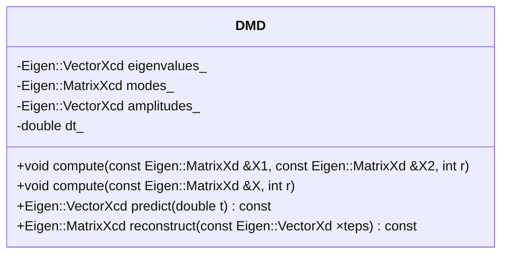

# Dynamic Mode Decomposition

## 基本概念

DMD（Dynamic Mode Decomposition）是一种数据矩阵分解方法，这个方法把数据矩阵当作是一个线性动力学系统的输出来看待。对于每个快照，假设有如下的线性动力学系统：

$$
\mathbf{x}_{i+1} = A \mathbf{x}_i
$$

这里的$\mathbf{x}_i$和$\mathbf{x}_{i+1}$是数据矩阵中的两个相邻的快照。矩阵$A$是线性动力学系统的线性演化矩阵。
对于一般的数据矩阵，通常并不能拟合一个线性动力学系统。

接下来，我们把数据矩阵$D$分解为两个部分，前$n_t-1$个快照为初始状态，后$n_t-1$个快照为演化后的状态。

$$
\mathbf{X}_1 = D(:, 1:n_t-1)
$$

$$
\mathbf{X}_2 = D(:, 2:n_t)
$$

有

$$
\mathbf{X}_2 = A \mathbf{X}_1
$$

## DMD分解的推导

如果我们对$\mathbf{X}_1$进行SVD分解，可以得到：

$$
\mathbf{X}_1 = U \Sigma V^T \approx \widetilde{\mathbf{X}}_{1, \tau}
$$

其中，$\widetilde{\mathbf{X}}_{1, \tau}$是$\mathbf{X}_1$的低秩（rank-$\tau$）近似。

完全求解$A$的问题可以弱化为求解矩阵$S$的问题。

$$
S = Q^{-1} A Q
$$

我们对原始的$\mathbf{X}_2$进行变换，步骤如下：

带入SVD分解的结果

$$
\mathbf{X}_2 = A \mathbf{X}_1 = A U \Sigma V^T
$$

两边左乘$U^T$，得到：

$$
U^T \mathbf{X}_2 = U^T A U \Sigma V^T
$$

两边右乘$V$，得到：

$$
U^T \mathbf{X}_2 V = U^T A U \Sigma V^T V = U^T A U \Sigma
$$

两边右乘$\Sigma^{-1}$，得到：

$$
U^T \mathbf{X}_2 V \Sigma^{-1} = U^T A U
$$

如此，我们即得到了$S$。

$$
S = U^T \mathbf{X}_2 V \Sigma^{-1}
$$

这里正定归一矩阵$U$，$U^T = U^{-1}$，就是前面的$Q$。
值得注意的是，这里的$U$并不一定是方阵，
相应的，$S$则为$\tau \times \tau$的矩阵。

对$S$进行特征值分解，可以得到：

$$
S = \Phi M \Phi^{-1}
$$

其中，$\Phi$是$S$的特征向量矩阵，$M$是$S$的特征值矩阵。
一般而言，$M$和$\Phi$是复数矩阵。
因为$S$的大小为$\tau \times \tau$，所以只能近似拟合$A$的前$\tau$个特征值。

将对角矩阵$M$的对角元素记为$\mathbf{\mu}$，则有：

$$
\mathbf{\mu}_i = e^{\omega_i}
$$

此处的$\omega_i$为相应脉动的复数频率，同样把这个向量记为$\mathbf{\omega}$。
有

$$
\mathbf{\omega} = \ln \mathbf{\mu}
$$

下面，我们得到DMD的空间模态为：

$$
\phi = U \Phi
$$

这个式子的物理含义可以理解为，将特征向量矩阵$\Phi$变换到$U$的列（正交）基上。

DMD的增益矩阵为：

$$
\mathbf{b} = (\phi^ \phi)^{-1} \phi^T \mathbf{x}_1
$$

这里的$\mathbf{x}_1$是$\mathbf{X}_1$的第一个列向量，也就是初始状态。

我们把DMD的时间模态表达为矩阵$\mathbf{T}_{\text{modes}}$，
则有该矩阵的尺寸为$\tau \times n_t$，该矩阵的第$i$列即为DMD的第$i$个时间模态，通过如下公式计算：

$$
\mathbf{t}_i = \mathbf{b} e^{\omega k} = \mathbf{b} e ^{\omega t_i/ \Delta t}
$$

此处，$k = \frac{t_i}{\Delta t}$，$\Delta t$为时间步长。因此，DMD要求时间步长$\Delta t$为常数。

值得注意的是，$\mathbf{T}_{\text{modes}}$的第$j$行对应一个频率（$\omega_j$）和一个增益（$b_j$）。

$$
t_{j, i} = b_j e^{\omega_j t_i/ \Delta t}
$$

到这里就可以写出DMD的表达式：

$$
\widetilde{D}_\tau = \phi \cdot \mathbf{T}_{\text{modes}}
$$

这里，增益矩阵和时间模态写在同一个矩阵中。


## 算法实现

采用[Eigen3](https://www.windtunnel.cn/eigen3tutorial/)库实现，计算的步骤和设计的主要矩阵大小如下：


1. 数据分组：$\mathbf{X}_1,\mathbf{X}_2, n_p \times n_t-1$
2. SVD分解：$\mathbf{X}_1 = U \Sigma V^T, \tau$
3. 相似矩阵：$S=U^T \mathbf{X}_2 V \Sigma^{-1}, \tau\times\tau$
4. 特征分解：$S = \Phi M \Phi^{-1}, \tau\times\tau$
5. 空间模态：$ \phi = U \Phi, n_p \times \tau$
6. 增益矩阵：$ \mathbf{b} = (\phi^T \phi)^{-1} \phi^T \mathbf{x}_1, \tau \times 1$
7. 频率向量：$\mathbb{\omega} = \ln \mathbf{\mu}, \tau \times 1$
8. 时间模态：$\mathbf{t}_i = \mathbf{b} e^{\omega k} = \mathbf{b} e ^{\omega t_i/ \Delta t}, i=1\ldots n_t$

### 实现

整个算法的最终接口与`POD`类似，输入数据，得到一个空间模态矩阵，一个时间系数（作为增益和时间模态的乘积），最终重建的近似数据为空间模态矩阵和时间系数的乘积。

```cpp
#pragma once
#include <Eigen/Dense>
#include <complex>
#include <vector>

class DMD {
public:
    DMD() = default;

    // Compute DMD modes from snapshot matrices X1 (x[0:n-1]) and X2 (x[1:n])
    // r is the desired rank of the approximation
    void compute(const Eigen::MatrixXd& X1, const Eigen::MatrixXd& X2, int r);

    // Compute DMD modes from a single snapshot matrix X
    // This will automatically create X1 and X2 by splitting X
    void compute(const Eigen::MatrixXd& X, int r);

    // Predict future state at time t
    Eigen::VectorXcd predict(double t) const;

    // Reconstruct the data at specified timesteps
    Eigen::MatrixXcd reconstruct(const Eigen::VectorXd& timesteps) const;

    // Getters for DMD components
    const Eigen::MatrixXcd& modes() const { return modes_; }
    const Eigen::VectorXcd& eigenvalues() const { return eigenvalues_; }
    const Eigen::VectorXcd& amplitudes() const { return amplitudes_; }
    double dt() const { return dt_; }

private:
    Eigen::MatrixXcd modes_;        // DMD modes (Phi)
    Eigen::VectorXcd eigenvalues_;  // DMD eigenvalues (Lambda)
    Eigen::VectorXcd amplitudes_;   // Mode amplitudes (b)
    double dt_;                     // Time step between snapshots
    int rank_;                      // Rank of approximation
}; 
```


### 结果展示

同样，DMD的计算结果可以可视化如下：


所有的代码，都可以在[Github Repository](https://github.com/qchen-fdii-cardc/fluiddecomposition)中找到。

运行命令：

```bash
git clone https://github.com/qchen-fdii-cardc/fluiddecomposition.git
cd fluiddecomposition
cmake -B build .
cmake --build build
./build/debug/pod_demo
./build/debug/dmd_demo
python ./scripts/visualize_flow.py
```


